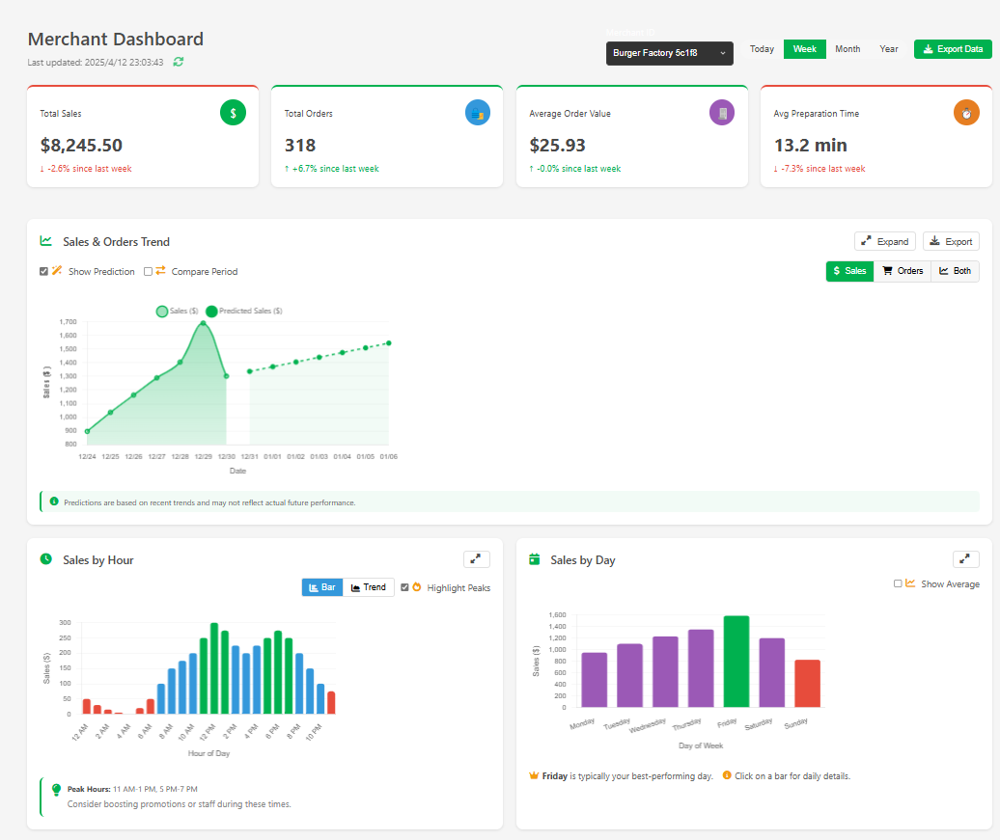
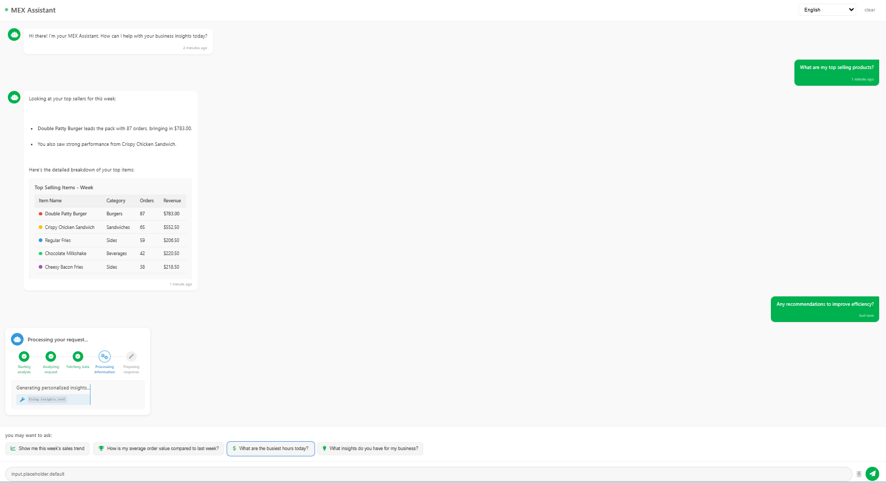
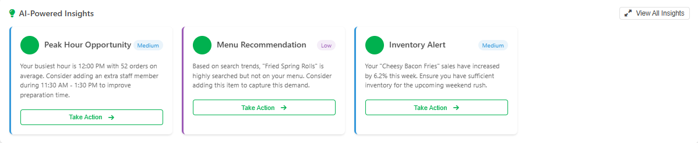
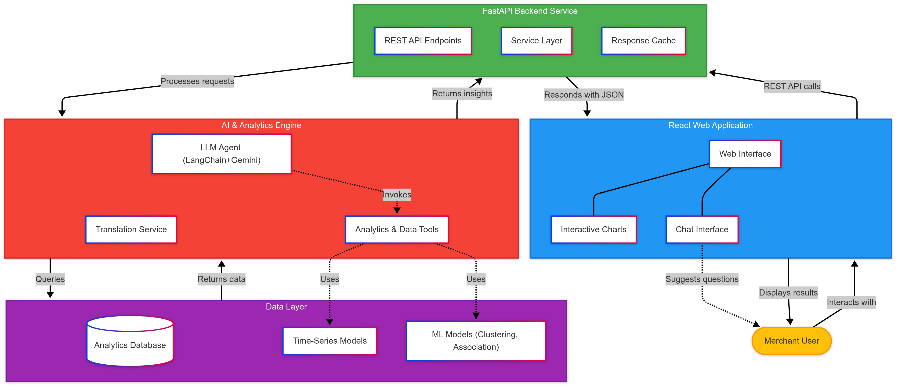

# UM Hackathon 2025 Domain 3 Task 2 - MEX Assistant: AI-Powered Merchant Partner Assistant By Sudo_Chill

<div align="center">
  


[Demo Video](https://365umedumy-my.sharepoint.com/:f:/g/personal/s2191553_siswa365_um_edu_my/Eu9_iqwzs5pFmNnACcNd4KgBg_pZpywrnXmDZQ8H9FFFrQ?e=uqMhA0) |
[Presentation Slides](https://www.canva.com/design/DAGkbIGBwmw/4M_EOHjB3KMtQOLt7hgckA/edit?utm_content=DAGkbIGBwmw&utm_campaign=designshare&utm_medium=link2&utm_source=sharebutton) |
[Proposal Document](https://www.notion.so/MEX-Assistant-Proposal-Sudo_Chill-1d36b616bf6b8087b9cac0def49c3d8d?pvs=4)
</div>

## 📋 Table of Contents
- [Overview]
- [Features]
- [Screenshots]
- [Technologies Used]
- [Architecture]
- [Project Structure]
- [Installation]
- [Usage]
- [API Integration]
- [Future Enhancements]
- [Team Members]
- [Acknowledgments]

## 🌟 Overview

MEX Assistant is an AI-powered chat-based assistant designed to help Grab merchant-partners improve their business performance. It provides real-time insights, actionable recommendations, and data visualizations to help merchants optimize their operations, menus, and sales strategies.

This project was developed for UMHackathon 2025, focusing on Grab's vision of economic empowerment through AI in Southeast Asia. Our solution addresses multiple challenges that merchants face:

- Delivering real-time business insights and alerts
- Providing personalized guidance based on merchant type, location, and scale
- Creating intuitive communication across multiple languages and technical skill levels

MEX Assistant leverages powerful data analytics, machine learning, and a conversational AI interface to transform complex business data into accessible, actionable insights for merchants of all sizes.

## ✨ Features

### Intelligent Assistant
- **Natural language interaction** - Merchants can ask business questions in plain language
- **Multilingual support** - Accommodates the diverse languages of Southeast Asia
- **Smart thinking process** - Transparently shows the assistant's analysis process
- **Context-aware recommendations** - Understands merchant's business type and history

### Dashboard
- **Real-time sales analytics** - Up-to-date performance metrics
- **Sales trend visualization** - Interactive charts showing sales and order patterns
- **Hourly and daily sales breakdown** - Identify peak business hours and days
- **Top selling items analysis** - Track best-performing products
- **AI insight report** - Obtain the recommendation and alert timely 

### AI-Powered Insights
- **Personalized business recommendations** - Custom guidance based on merchant data
- **Anomaly detection** - Alert merchants to unusual patterns in their data
- **Performance comparisons** - Benchmarking against historical data
- **Actionable suggestions** - Specific steps merchants can take to improve business

### User Experience
- **Intuitive interface** - Easy to navigate for users of all technical levels
- **Responsive design** - Works on various devices and screen sizes
- **Suggested questions** - Helps merchants discover insights they might not think to ask
- **Multi-format visualizations** - Presents data in the most understandable format

## 📸 Screenshots

<div align="center">
  
  <p><em>Dashboard showing key performance indicators and visualizations</em></p>

  
  <p><em>Chat interface with the AI assistant analyzing business data</em></p>

  
  <p><em>AI-powered insights and recommendations</em></p>
</div>

## 🛠 Technologies Used

- **Frontend Framework**: React.js with Vite
- **UI Components**: Custom components with responsive design
- **State Management**: React Context API
- **Visualization**: Chart.js / Recharts for data visualization
- **Styling**: CSS Modules / Styled Components
- **Icons**: Font Awesome
- **Internationalization**: i18next for multilingual support
- **Mock Backend**: Simulated API with realistic data models
- **Version Control**: Git & GitHub

## 🏛 Architecture

The MEX Assistant follows a modular architecture with clear separation of concerns:




1. **UI Layer**: React components for rendering the interface
2. **State Management**: React Context API for global state
3. **Service Layer**: API interaction and data processing
4. **Data Layer**: Mock services (replaced by real APIs in production)

### Key Architectural Decisions:

- **Component Modularity**: Each UI component is self-contained with its own styles and logic
- **Context Separation**: Different contexts for chat, dashboard, and app-wide state
- **Responsive Design**: Fluid layout that adapts to different screen sizes
- **Mock Service Layer**: Simulates backend while maintaining realistic architecture

## 📁 Project Structure

```
/mex-assistant-frontend
├── public/
│   ├── index.html
│   ├── favicon.ico
│   └── locales/            # Translation files
├── src/
│   ├── assets/             # Static assets
│   ├── components/         # Reusable UI components
│   │   ├── common/         # Shared components
│   │   ├── chat/           # Chat interface components
│   │   ├── dashboard/      # Dashboard components
│   │   ├── layout/         # Layout components
│   │   └── visualizations/ # Chart components
│   ├── contexts/           # React contexts
│   ├── data/               # Mock data
│   ├── hooks/              # Custom React hooks
│   ├── pages/              # Main page components
│   ├── services/           # API services
│   ├── styles/             # Global styles
│   ├── utils/              # Utility functions
│   ├── App.jsx             # Main app component
│   └── main.jsx            # Entry point
├── .env                    # Environment variables
├── package.json            # Dependencies
└── vite.config.js          # Vite configuration
```

## 📥 Installation

Follow these steps to set up the project locally:

```bash
# Clone the repository
git clone https://github.com/ziflhigan/mex-assistant-frontend.git

# Navigate to the project directory
cd mex-assistant-frontend

# Install dependencies
npm install

# Create a .env file based on .env.example
cp .env.example .env

# Start the development server
npm run dev
```

### Prerequisites
- Node.js 16+
- npm or yarn

## 🚀 Usage

Once installed, you can:

1. **Launch the application**: Open `http://localhost:5173` in your browser
2. **Switch between views**: Use the sidebar to navigate between Dashboard and Chat
3. **Interact with the AI Assistant**: Ask business questions in the chat interface
4. **Explore the dashboard**: View charts and metrics for business performance
5. **Change the merchant**: Select different merchant accounts from the sidebar
6. **Adjust time periods**: Filter data by Today, Week, Month, or Year

### Example Interactions

Try asking the AI Assistant questions like:
- "Show me my top selling items this week"
- "What were my sales trends for this month?"
- "When are my busiest hours?"
- "How does my average order value compare to last week?"
- "What insights do you have for my business?"

## 🔌 API Integration

This prototype uses simulated data, but is designed for easy integration with real APIs:

### Service Layer
The `services` directory contains mock service functions that mimic API calls:

```javascript
// Current mock implementation 
export const getDashboardData = async ({ merchantId, timeFilter }) => {
  await delay(300); // Simulate network request
  return mockData[timeFilter][merchantId] || mockData[timeFilter].default;
};

// Future implementation would be:
export const getDashboardData = async ({ merchantId, timeFilter }) => {
  const response = await fetch(`${API_URL}/dashboard?merchantId=${merchantId}&period=${timeFilter}`);
  return response.json();
};
```

### API Endpoints
The application is designed to work with these API endpoints:
- `/api/dashboard` - Get dashboard statistics and metrics
- `/api/chat` - Process AI assistant interactions
- `/api/insights` - Retrieve AI-generated insights
- `/api/merchant` - Get merchant information

## 🔮 Future Enhancements

Planned improvements for future versions:

- **Real AI Integration**: Replace mock responses with a real LLM-based agent
- **Live Data Connection**: Integrate with actual transaction data systems
- **Advanced Analytics**: Add predictive forecasting and deeper insights
- **Mobile App**: Develop a native mobile version for on-the-go access
- **Expanded Visualization**: Add more chart types and interactive elements
- **Notification System**: Proactive alerts for important business events
- **Voice Interface**: Add speech recognition for hands-free operation

## 👥 Team Members

- Zhili Fang - Team Leader/Project Manager
- Yerong Liu - System Architect
- Xin En Lin - UI/UX Designer
- Yanguo Xu - Frontend Engineer

## 🙏 Acknowledgments

- UMHackathon 2025 organizers
- Grab for the opportunity and mentorship
- [Any other organizations or individuals who provided support]

---

<div align="center">
  <p>Developed for UMHackathon 2025 by Sudo_Chill | Domain 3: Economic Empowerment through AI</p>
</div>
